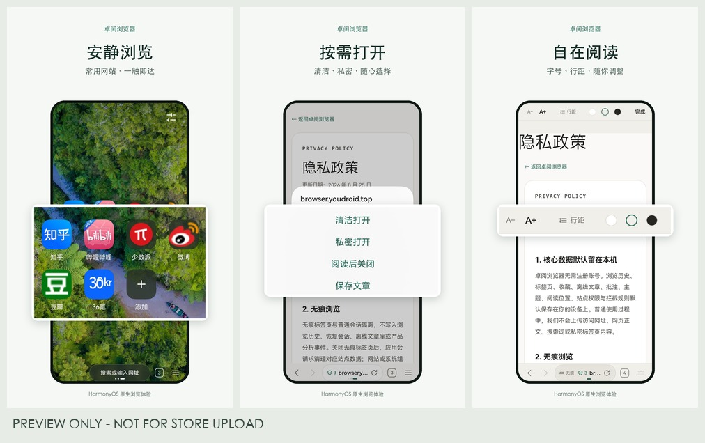

# 卓阅浏览器 · 商店填充预览

日期：2026-09-03。选择 AGC 后，将填写并保存以下内容、上传三张手机宣传图；不会关联软件包、提交审核或发布版本。

## 目标

- 商店：AGC；账号页面显示「毛豆的毛豆Y / 杨亮」。
- 应用：卓阅浏览器；APP ID：6917614109541548410；包名：com.youdroid.zhuobrowser。
- 草稿：v2020673007369873856，状态「准备提交」；尚未关联发布软件包。
- 文案依据：当前源码与已安装 HarmonyOS 1.0.1；正式提交前需核对届时关联的软件包。
- 语言：现有默认简体中文；不新增语言。
- ASC：未发现 iOS 工程和可核验的 ASC 应用记录，不提供填充选项。

## 字段变更

| 页面 / 字段 | 当前值 | 拟填值 |
| --- | --- | --- |
| 应用信息 / 官网 | 空 | https://browser.youdroid.top/ |
| 应用信息 / 客服邮箱 | 空 | youdroid2048@gmail.com |
| 版本信息 / 应用介绍 | 空 | 下方完整文案，786 / 8000 字 |
| 版本信息 / 一句话简介 | 空 | 少一点干扰，多一点阅读（11 / 17 字） |
| 版本信息 / 审核备注 | 空 | 下方完整备注，144 / 300 字 |
| 版本信息 / 会员收费 | 未勾选 | 勾选；与实际 Pro 内购能力一致 |
| 版本信息 / AI 生成合成服务 | 未选择 | 不涉及；应用未提供生成式 AI 服务 |
| 版本信息 / 隐私政策 | 隐私托管，未选政策 | 自定义隐私政策：https://browser.youdroid.top/privacy.html |
| 版本信息 / 用户协议 | 未选择 | https://browser.youdroid.top/terms.html；若控制台没有直接填写 URL 的能力则标记待补，不创建托管协议 |

官网、隐私政策及用户协议均已在浏览器中打开并核对正文和客服邮箱；通用 HTTP 客户端返回 403。

### 应用介绍

卓阅浏览器是一款为 HarmonyOS 打造的网页浏览与阅读工具。打开链接、专注阅读，把值得留下的内容整理为自己的本地资料。

【少一点干扰，多一点阅读】
支持广告与追踪拦截、站点例外和阅读模式。按自己的习惯调整字号、行距与阅读底色，让注意力回到正文。实际拦截与正文提取效果会因网站而异。

【链接怎么打开，由你决定】
接收其他应用分享的网页链接，选择清洁打开、私密打开或阅读后关闭；需要留存时，可使用 Pro 保存文章。常用网站快捷入口、书签、多标签和页面查找，让日常浏览更顺手。

【隐私设置，自己掌握】
基础浏览无需注册账号。浏览历史、收藏和设置默认保存在本机；无痕标签页不写入浏览历史和恢复会话。支持清理浏览数据、管理站点权限与拦截例外。无痕模式并不意味着对网站或网络服务匿名。

【把网页变成阅读资料】
卓阅 Pro 提供离线文章库、全文搜索、主题整理、笔记与高亮批注，并支持 Markdown 和 HTML 导出。正文与阅读位置保存在本机，便于继续阅读和回顾。请仅保存、导出有权使用的内容，并为重要资料保留备份。

【从手机到大屏】
界面随手机、平板和二合一设备的窗口尺寸调整，支持多窗口与大屏侧栏，让浏览、阅读和整理各得其所。

【功能与付费说明】
基础浏览、标签页、阅读模式及基础拦截功能免费使用。离线文章库及搜索、批注、主题、导出等进阶能力需要购买卓阅 Pro。具体方案与价格以应用内及 AppGallery 支付页面为准；月度、年度方案为自动续费订阅，可通过系统订阅管理取消。购买、恢复及权益验证需要网络连接。

隐私政策：https://browser.youdroid.top/privacy.html
用户协议：https://browser.youdroid.top/terms.html
联系支持：youdroid2048@gmail.com

### 审核备注

基础浏览和阅读模式无需注册账号。打开网页后可从菜单进入阅读模式；其他应用分享链接至卓阅，可选择清洁打开、私密打开或阅读后关闭。离线文章库、搜索、批注、主题与导出需要卓阅 Pro，可从设置中的会员中心查看方案和恢复购买。请使用华为审核测试环境验证内购；本次仅完善元数据，尚未关联发布软件包。

## 宣传图

将手机截图方向设为竖向，依次上传以下三张图片。当前没有旧截图，不删除或替换其他资产。上传前核对切换方向后显示的 9:16 要求。平板、PC/2in1 暂无当前版本截图，不冒用手机素材。

| 顺序 | 文件 | 尺寸 | 字节数 | SHA-256 |
| --- | --- | --- | --- | --- |
| 1 | app-store-assets/generated/harmony-agc-phone/zh-Hans/01.png | 1080×1920 | 1663801 | 341813f3f896ab4f00e320034869ba4c1849f2c405fa0d71c1aa317012f86549 |
| 2 | app-store-assets/generated/harmony-agc-phone/zh-Hans/02.png | 1080×1920 | 326183 | 2f6562e668251bd594e63b011f2afa7ac6d9c0a66b983658bcc69ab38b9ec368 |
| 3 | app-store-assets/generated/harmony-agc-phone/zh-Hans/03.png | 1080×1920 | 322191 | e8271f7e7eccb678c77f0892005a97ea1c4a75ceeab58a60d9faadf7acc62a52 |

## 保持原样与待补项目

保持应用名称、应用分类（应用 / 工具）、支持设备、分发区域、供应商信息、已有出境声明选项和上架时间不变。保存草稿不等同上架；控制台提示基础信息更改需随版本提交审核后生效。

以下项目未确认或缺少材料，不会凭空填写：应用标签、平板与 PC/2in1 素材、软件包关联、年龄分级、隐私数据标签、备案与版权材料、审核负责人已验证手机号及验证码。若保存因这些必填项受阻，将保留填写结果并逐项报告。

Cyclar 跟踪受阻：当前没有可用 MCP 凭据，网页会话未登录。需恢复登录后创建/更新 Issue 并补充本次交付结果。

## 填充文件校验

- Payload: app-store-assets/metadata/agc/zh-Hans/metadata.json
- SHA-256: 41ee9875a0cfc697e6b00510305b890e5cc7889cbe4077f643182ed1c0037cae
- 图片与原始截图的完整清单及校验值：app-store-assets/generated/manifest.json。
- 选择只针对本预览和上述文件哈希；内容变化后需重新展示。
